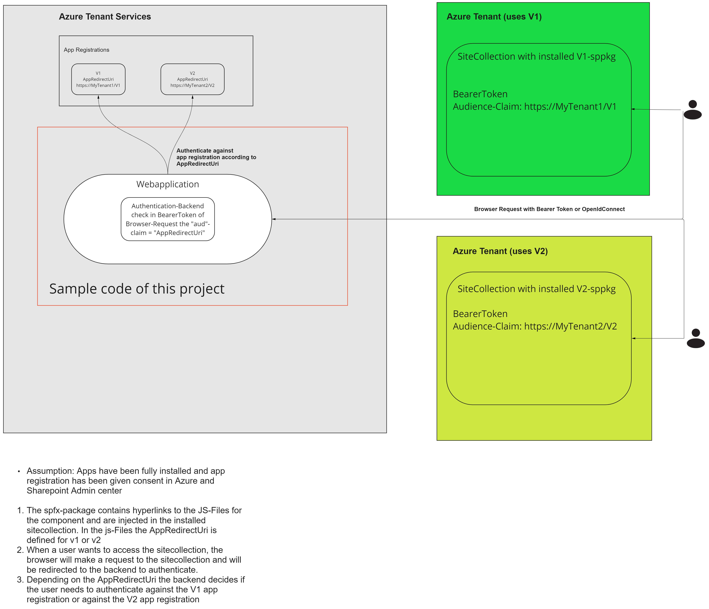

# Introduction: Two SPApps, one Backend

## Scenario:
We have two SharePoint Apps V1 and V2, both are connected with Azure App Registrations V1 and V2, which have different underlying api permissions.

There is one backend webservice which should be used by both sharepoint apps.
The Audience claim in the Bearer Token can be used to distinguish which azure app registration should be used for the calling SharePoint App.

## Test it

- Hit F5
- Hit F12 for DEV Toolbar
- /MockedBearerTokens:
Contains fake Bearer Tokens V1 and V2 for the input for the Swagger Authorize field
- Add a Fake Bearer Token in the "Authorize" Field in Swagger and execute a request

- In the Dev Console, you will notice an error with a redirect to the microsoft login page. Verify the url and you will see that depending on the Bearer Token input, it redirects you to V1 or V2.